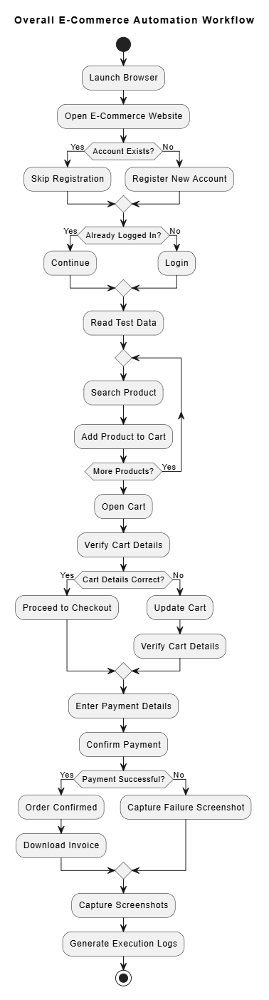
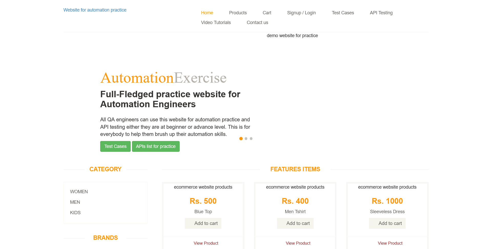
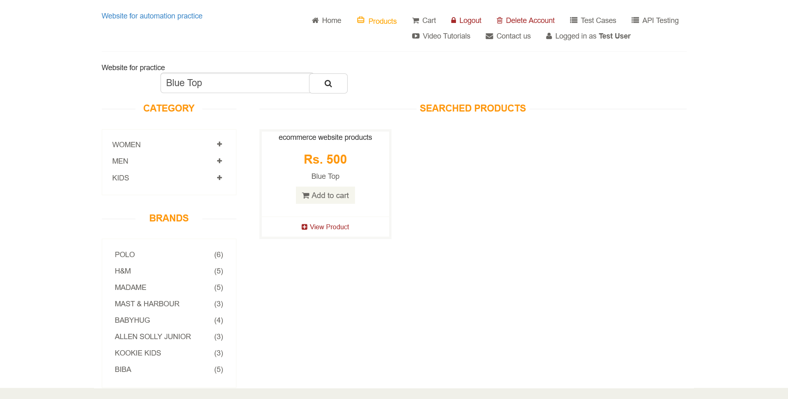
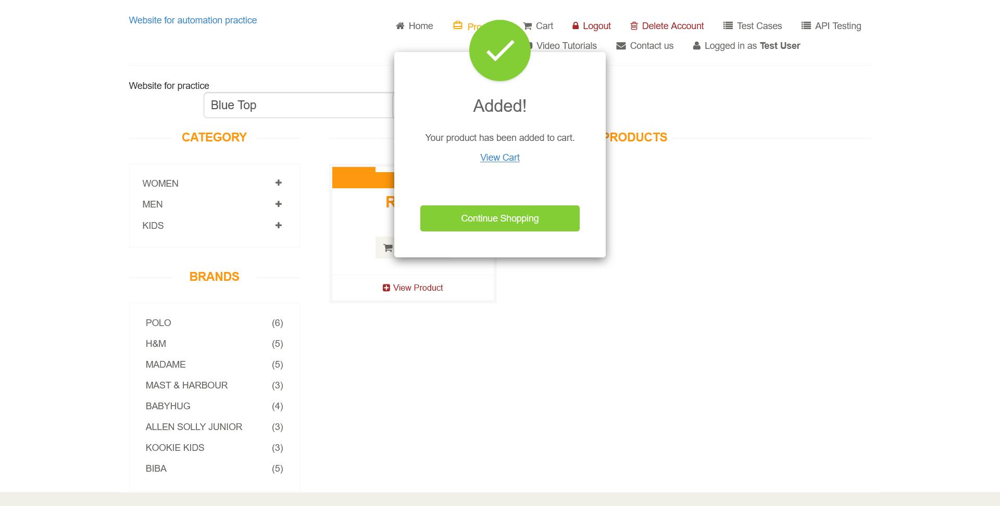
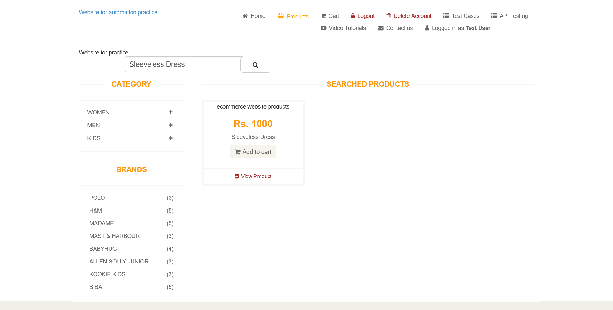
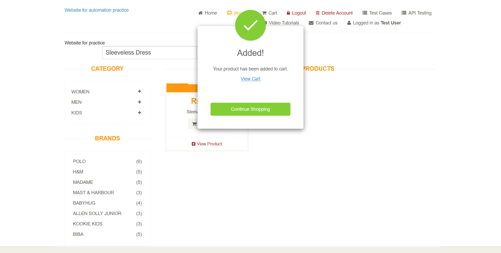
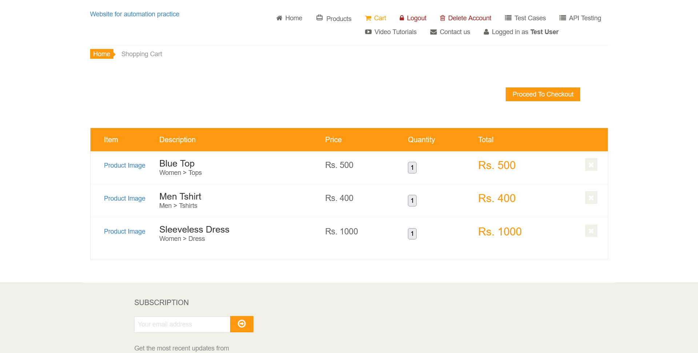
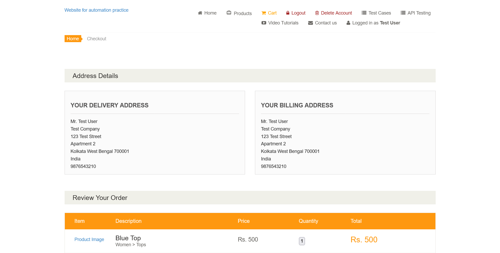
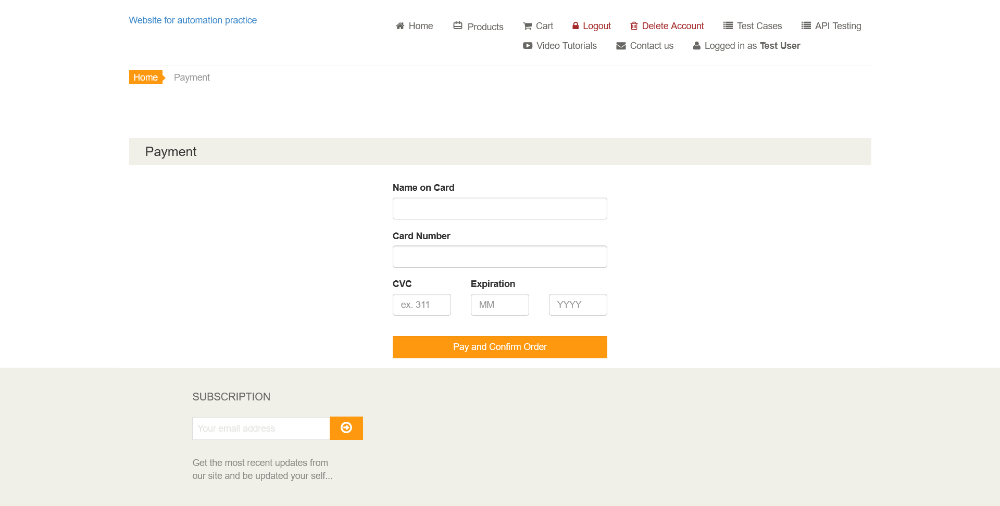
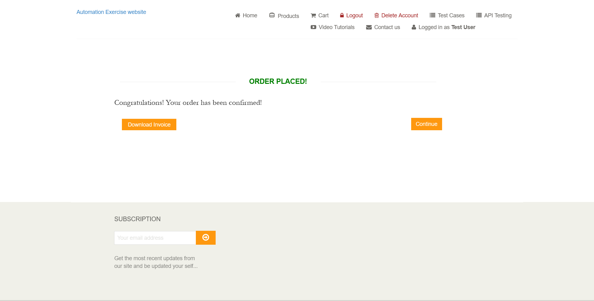

# E-commerce Website Automation

## Objective

This project automates a complete customer shopping journey on the [Automation Exercise demo website](https://automationexercise.com/). The goal is to exercise the main user-facing steps together in one browser session and keep evidence of what the run did:

1. Open the storefront and capture its initial state.
2. Register a test customer when needed, then make sure the customer is logged in.
3. Read a configurable list of products, find each product, and add it to the cart.
4. Open the cart and proceed through checkout and order placement.
5. Enter the site's test payment details, submit the order, and capture the confirmation page.

The code is organized into small Python modules so account management, product search, cart operations, screenshots, and logging can be maintained separately. Account and product inputs are held in CSV files, and the target URL is held in `config.ini`.

## How the workflow proceeds

`test_ecommerce.py` is the Pytest end-to-end entry point. Its browser fixture reads the URL, starts Firefox, maximizes the window, opens the site, and saves a homepage screenshot. The test then passes the same WebDriver session through the workflow:

1. **Register or reuse an account:** `register.py` reads the first record in `testdata.csv` and attempts signup. If the account-information form does not appear after signup, registration returns early (for example, when the email is already registered).
2. **Log in if needed:** `login.py` checks for a Logout link. If the user is not already logged in, it signs in with the email and password from `testdata.csv` and waits for the logged-in indicator.
3. **Search and add each product:** `test_ecommerce.py` reads product names from `products.csv`. For each row, `search.py` opens the Products page, searches by name, and waits for that exact name to appear in results. `cart.py` locates the matching product card and adds it to the cart.
4. **Review cart and checkout:** The test opens the cart, proceeds to checkout, and selects Place Order.
5. **Submit payment:** `cart.py` enters the test card values, captures the payment-details screen, submits the form, waits for navigation, and saves the order-success screenshot.
6. **Close and record:** The fixture closes Firefox after the test. `logger.py` writes execution messages and failures to `log.txt`; `screenshot.py` saves PNG evidence under `screenshots/`.

The test uses Selenium explicit waits at important page and control transitions to synchronize with the site. The Firefox fixture uses the eager page-load strategy and disables image loading to reduce unnecessary page-load time.

## Flowchart

The project includes a rendered flowchart at `Report/flowchart.png` (with its PlantUML source at `Report/Flowchart.uml`):



## Screenshots

The checked-in screenshots illustrate the important checkpoints from the end-to-end journey. They are generated by the automation and stored in the `screenshots/` directory.

### Storefront



### Product search and add to cart

The first view is captured before clicking Add to Cart; the second shows the site's added-to-cart dialog.

| Product card                                                                   | Added to cart                                                                  |
| ------------------------------------------------------------------------------ | ------------------------------------------------------------------------------ |
|                  |                  |
|              |              |
|  |  |

### Cart, checkout, and order confirmation

| Cart                                        | Checkout                                        | Payment                                       | Payment details                                             | Confirmation                                    |
| ------------------------------------------- | ----------------------------------------------- | --------------------------------------------- | ----------------------------------------------------------- | ----------------------------------------------- |
|  |  |  |  |  |

## Project files

| File                                           | Purpose                                                                                                                              |
| ---------------------------------------------- | ------------------------------------------------------------------------------------------------------------------------------------ |
| `test_ecommerce.py`                            | Pytest scenario and Firefox fixture for the complete shopping flow.                                                                  |
| `launch.py`                                    | Standalone runner for the same high-level workflow.                                                                                  |
| `register.py`                                  | Account registration from CSV test data.                                                                                             |
| `login.py`                                     | Login when the browser session is not already authenticated.                                                                         |
| `search.py`                                    | Product page navigation, search, and result verification.                                                                            |
| `cart.py`                                      | Add-to-cart, cart viewing, checkout, order placement, and payment.                                                                   |
| `products.csv`                                 | Product names processed by the test. The current script reads the `product` column; the `quantity` values are not currently applied. |
| `testdata.csv`                                 | Test account, password, and registration details.                                                                                    |
| `config.ini`                                   | Application URL used by the runner and test.                                                                                         |
| `screenshot.py`                                | Creates the screenshots directory and saves browser screenshots.                                                                     |
| `screenshots/`                                 | Captured UI evidence from the workflow.                                                                                              |
| `logger.py`, `log.txt`                         | Logging configuration and recorded execution output.                                                                                 |
| `popup.py`                                     | Optional ad-iframe removal helper; its calls are currently commented out in the flow.                                                |
| `Report/Flowchart.uml`, `Report/flowchart.png` | PlantUML source and rendered overview diagram.                                                                                       |

## Setup and run

### Requirements

- Python 3.10 or later
- Firefox browser
- Selenium 4
- pytest
- A compatible Firefox WebDriver (GeckoDriver), available on `PATH` or managed by the Selenium version in use
- Network access to Automation Exercise

Install the Python dependencies if they are not already available:

```powershell
python -m pip install selenium pytest
```

From the project directory, run the end-to-end test:

```powershell
python -m pytest -v test_ecommerce.py
```

Or run the standalone workflow:

```powershell
python launch.py
```

Both approaches launch Firefox and perform live browser actions on the demo site. The Pytest fixture captures the homepage before the scenario starts and closes Firefox when the test finishes. The standalone runner also closes Firefox in a `finally` block.

## Test data and configuration

- Set the target site under `[application]` in `config.ini`.
- Put one registration/login record in `testdata.csv`. The implementation reads the first data row and expects the headers already present in that file.
- Add product rows in `products.csv`; each row needs a `product` value matching a name on the site's search results. Although the file also has a `quantity` column, the current automation adds each matching product once and does not set quantity from that column.
- The payment values are currently fixed in `cart.py` and are intended for the demo site's test flow, not a real payment.

Keep personal or reusable credentials out of source control. Use test-only account data and replace any committed sample credentials before sharing or deploying this project.

## Evidence and troubleshooting

- Screenshots are written to `screenshots/<name>.png`; a run may replace screenshots with the same names.
- Runtime messages and exception summaries are appended to `log.txt` according to Python's logging configuration.
- If the browser fails to start, check Firefox and Selenium/GeckoDriver compatibility.
- If the flow times out, check network access and whether the demo site's page structure or product names have changed.
- Registration may be skipped when the supplied email already has an account. Ensure `testdata.csv` contains credentials for that existing account so the login step can succeed.

## Demo Video Link

- https://drive.google.com/file/d/174UedVAduRfXUNB5MqZC1F5WwLPjCLWx/view?usp=sharing
